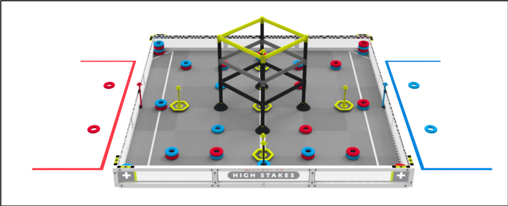
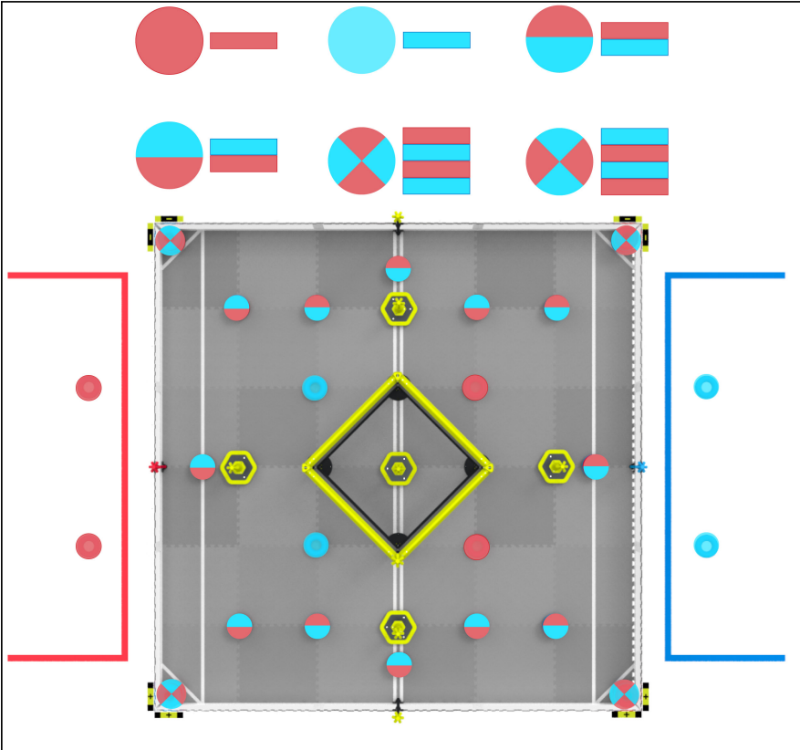

# High Stakes 2024-2025 — VEX U

Código fuente del equipo Javex de la Pontificia Universidad Javeriana para la temporada High Stakes de VEX Robotics Competition (categoría VEX U).

## Sobre la competencia

VEX U High Stakes se desarrolla en un campo de 12' × 12', donde el objetivo principal es acumular la mayor cantidad de puntos insertando anillos (Rings) en estacas (Stakes), posicionando metas móviles (Mobile Goals) en las esquinas del campo y realizando la trepa en la estructura central (Ladder). Cada partido consta de 30 segundos de período autónomo, seguidos de 1 minuto y 20 segundos de control por el conductor (driver control). El campo cuenta con 48 anillos y 9 estacas distribuidas entre metas móviles, paredes de alianza, estacas neutrales y la parte superior de la escalera.

Cada anillo vale 1 punto, mientras que el anillo ubicado en la parte superior de cada estaca otorga 3 puntos. La escalera cuenta con tres niveles de escalada, que otorgan 3, 6 y 12 puntos, respectivamente.

En la categoría VEX U, el desafío exige un alto nivel de ingeniería debido al diseño de dos robots complementarios: uno pequeño de 15" × 15" × 15" y otro grande de 24" × 24" × 24". Las principales dificultades técnicas incluyen la manipulación precisa de piezas cilíndricas, el diseño de sistemas de sujeción rápida (clamps) para las metas móviles, la clasificación en tiempo real de anillos por color y el desarrollo de un mecanismo de elevación rígido para alcanzar el nivel 3 de la escalera. Desde el punto de vista estratégico, es fundamental controlar las zonas de las esquinas positivas y negativas, así como mantener una coordinación fluida entre ambos robots para optimizar los 30 segundos del período autónomo exclusivo de VEX U.

## Proyectos

| Proyecto | Archivos fuente | Tamaño | Toolchain | Estado |
|----------|----------------|--------|-----------|--------|
| My_First_Autonomous | 1 .cpp + 1 .h | ~6.4 KB | VEXcode | Completo (principiante) |
| Autonomo_David | 1 .cpp + 1 .h | ~10 KB | VEXcode | Completo |
| Grande_Azul | 1 .cpp + 4 .h | ~18.7 KB | VEXcode | Completo |

---

### My_First_Autonomous

**Archivo:** `src/David_Beltran_CodigoFinal.cpp`

Proyecto de admision al equipo. Primera experiencia del autor con VEX
Robotics.

**Mecanismos controlados:** 8-motor tank drive (4L + 4R, engranaje
18:1 de alta velocidad), rampa de recoleccion (2 motores en
`motor_group RampaCompleta`), garra (2 motores en `motor_group
GarraCompleta`). Sin neumaticas (comentario del autor:
`//agarrarEstaca(); No entendi como usar la Neumatica :(`).

**Rutinas autonomas:** Una sola rutina secuencial open-loop con ~15
movimientos puramente temporizados (sin sensores). Secuencia: retrocede
3s, gira 0.8s, avanza 1s, gira, avanza 3s, opera garra, etc.

**Sensores y control:** Ninguno. Todo el movimiento es time-based sin
retroalimentacion. No hay IMU, encoders externos ni PID.

**Notas tecnicas:** El codigo corre en `main()` dentro de un
`while(true)` tras la seccion de driver control, sin estructura de
competencia (`vex::competition`). Los comandos autonomos se ejecutan en
cada iteracion del loop de driver (no hay separacion real). Dos modos
de control (tank con Axis3+Axis2 y arcade con Axis3+Axis4) se ejecutan
simultaneamente; el ultimo par de `spin()` sobrescribe al primero, por
lo que solo arcade funciona realmente.

---

### Autonomo_David

**Archivo:** `src/main.cpp`

Prototipo de autonomo con correccion por sensor inercial. Sin
estructura de competencia.

**Mecanismos controlados:** 8-motor tank drive (4L + 4R),
recolector (PORT1), rampa (PORT12), garra (PORT15), pinza neumatica
(3-wire A), recolector neumatico (3-wire B), brazo neumatico (3-wire C).

**Rutinas autonomas:** Una sola secuencia con ~20 movimientos usando
`moveWithInertialSensor()` para correccion proporcional de rumbo.
Incluye recoleccion neumatica, operacion de garra y activacion de
rampa. Varios movimientos estan comentados (bloque `*/` sin `/*`
correspondiente en linea 234).

**Sensores y control:** IMU en PORT11. Control proporcional con
`RELATIVE_DISTANCE_ERROR = 0.4445` (factor empirico de correccion de
distancia). Correccion de rumbo: `kp = 0.5` sobre error de yaw.
Incluye correccion por aceleracion lateral/longitudinal.

**Notas tecnicas:** La funcion `rotateOnAxis()` es llamada pero no
esta definida. `moveWithInertialSensor()` se invoca con 4 argumentos
pero solo hay sobrecarga de 3 parametros. El codigo no compilaria sin
las definiciones faltantes.

---

### Grande_Azul

**Archivos:** `include/configuration.h`, `include/driver.h`,
`include/funciones_posicionales.h`, `src/main.cpp`

Proyecto mas modular y completo de la temporada. Autoria declarada en
`configuration.h` linea 3: Kenneth Bustamante (commiteado por David
Beltran).

**Mecanismos controlados:** 8-motor tank drive con `motor_group` Left
(PORT14,18,19,20) y Right (PORT7,8,9,10), rampa dual (PORT12 + PORT5
en `motor_group Rampa`), recolector (PORT13), garra (PORT3), pinza
neumatica (3-wire A), recolector neumatico (3-wire B), brazo neumatico
via expansor triport (3-wire C en PORT16).

**Rutinas autonomas:** 6 fases con estructura de competencia estandar
(`pre_auton`, `autonomous`, `usercontrol`):

1. **Anotar primer anillo:** `moveParabolicV(81,80,67,69)` avanzando
   con recoleccion. Luego `moveParabolic(19,-95.5,-98)` hacia atras y
   `recoleccion(100,2)` para anotar 2 anillos.
2. **Recuperar meta movil:** Avanza 10", rota 37", retrocede 39",
   abre pinza, rota 71".
3. **Recoger anillos superiores:** Abre recolector neumatico, avanza
   38", cierra, recolecta 3s.
4. **Recoger anillo inferior:** Rota -30", diagonal con recoleccion,
   recolecta 3s, retrocede 4".
5. **Anillos de esquina:** Rota 16", abre brazo, avanza 23", rota 65",
   retrocede 6", cierra pinza, rota, avanza a esquina positiva.
6. **Acercarse a la escalera:** Cierra brazo, avanza 43".

**Sensores y control:** Encoders de motor para distancia y rotacion.
8 funciones de movimiento en `funciones_posicionales.h`:
`moveDistance`, `moveParabolic` (curvas con velocidad diferencial),
`rotateOnAxis`, y variantes con recoleccion (`moveDistanceV`,
`moveParabolicV`, `moveParabolicN`, `moveParabolicNC`,
`moveDistanceN`, `moveDistanceB`, `rotateOnAxisB`). Usa
`RELATIVE_DISTANCE_ERROR` para compensacion empirica. Sin IMU ni PID
formal.

**Driver:** Dos modos seleccionables con boton Y:
- Modo 0 (`twoJoysticksControl`): arcade con Axis3 (avance) + Axis1
  (giro).
- Modo 1 (`joystickNewControl`): tank con Axis3 (izquierda) + Axis2
  (derecha).

L1/L2 controlan recoleccion + rampa (adelante/atras al 100%). X/A
controlan garra. R2 togglea pinza neumatica. R1 abre recolector
neumatico (se cierra al soltar). B togglea brazo neumatico.

**Notas tecnicas:** `#pragma once` usado en todos los headers.
`motor_group` abstrae grupos de motores. Sin IMU. Sin testing
automatizado.

---

## Como compilar

Cada proyecto es independiente. Abrir la carpeta del proyecto en
VEXcode Pro V5 y compilar desde el IDE. Los archivos `makefile` y
`vex/mkenv.mk` / `vex/mkrules.mk` estan incluidos para compilacion
por linea de comandos con el toolchain ARM GCC de VEX.

Requisitos:
- VEXcode Pro V5 (recomendado)
- O ARM GCC toolchain de VEX en PATH

## Contributors

Basado en autoria declarada en headers de codigo e historial de git.

| Persona | Rol | Evidencia |
|---------|-----|-----------|
| Melissa Ruiz Barrera | Lider subsistema de Programación | |
| David Beltran Gomez | Programador | Commits en `My_First_Autonomous` y `Autonomo_David` |
| Kenneth Bustamante | Programador | `Grande_Azul/include/configuration.h`|
