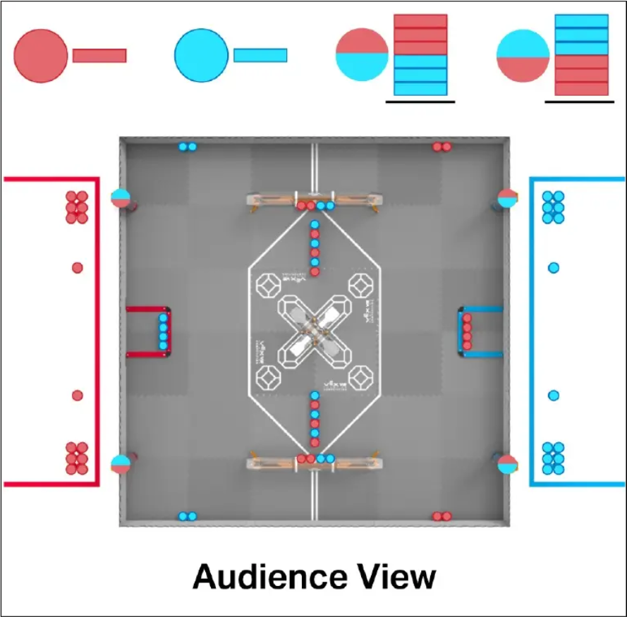

# Push Back 2025-2026 — VEX U

Código fuente del equipo Javex de la Pontificia Universidad Javeriana para la temporada Push Back de VEX Robotics Competition (categoría VEX U).

## Sobre la competencia

Push Back se desarrolla en un campo cuadrado de 12' × 12', donde el objetivo principal es acumular la mayor cantidad de puntos depositando bloques (*Blocks*) en metas (*Goals*), dominando el control territorial de zonas (*Zones*) estratégicas y estacionando (*Park*) los robots al finalizar el partido. Cada encuentro consta de 30 segundos de período autónomo, seguidos de 1 minuto y 20 segundos de control por el conductor (*driver control*). El campo cuenta con 88 bloques y 4 metas: 2 metas largas (*Long Goals*) y 2 metas centrales (*Center Goals*).

En la categoría VEX U, el desafío exige un diseño avanzado al coordinar dos robots con restricciones dimensionales distintas: uno de 15" × 15" × 15" y otro de 24" × 24" × 24". Las principales dificultades técnicas incluyen el desarrollo de mecanismos de admisión (*intake*) de alta capacidad y clasificación rápida de bloques, sistemas de indexado eficientes para alimentar metas de gran capacidad y mecanismos robustos que permitan asegurar el estacionamiento doble simultáneo (*double park*). Desde el punto de vista estratégico y de software, son determinantes una odometría de alta precisión, el uso de visión computacional para el mapeo dinámico de bloques en el campo y la coordinación entre ambos robots durante el período autónomo exclusivo de 30 segundos para asegurar el control de las zonas clave desde el inicio del encuentro.



## Equipo

| Persona | Rol |
|---------|-----|
| Melissa Ruiz Barrera | Lider subsistema de Programación |
| Miguel Casallas | Miembro subsistema|
| David Beltran | Miembro subsistema|

Nota: Todos los commits en el repositorio son de David Beltran. Los
demas miembros contribuyeron pero sin
commits propios en este repositorio.

## Proyectos

| Proyecto | Toolchain | Archivos fuente | Tamaño | Trackeado | Proposito |
|----------|-----------|----------------|--------|-----------|-----------|
| testIMU | VEXcode | 1 .cpp + 5 .h | ~19 KB | Si | Prueba de IMU + PID |
| ProgramacionGrande | VEXcode | 1 .cpp + 4 .h | ~19 KB | Si | Template basico robot grande |
| PlantillaProgramacionRobotGrande | VEXcode | 1 .cpp + 4 .h | ~23.5 KB | Si | Template refinado robot grande |
| Estrategia1Izq | VEXcode | 1 .cpp + 4 .h | ~28.5 KB | Si | Estrategia 1: lado izquierdo |
| Estrategia2 | VEXcode | 1 .cpp + 4 .h | ~21.7 KB | Si | Estrategia 2: centro (WIP) |
| ParteAzul | VEXcode | 1 .cpp + 4 .h | ~25.8 KB | Si | Alianza azul |
| Estrategia1IzqPruebas | VEXcode | 1 .cpp + 4 .h | ~18 KB | Si (directorio eliminado) | Pruebas de Estrategia1Izq |
| firstChallengeIMU-PID-Encoders | VEXcode | 1 .cpp + 4 .h | ~18.9 KB | No | Primer prototipo PID |
| autonomoEncoders-IMU | VEXcode | 1 .cpp + 4 .h | ~18.9 KB | No | Autonomo con encoders + IMU |
| autonomoIMU-Chiquito | VEXcode | 1 .cpp + 4 .h | ~18.3 KB | No | Autonomo robot chico |
| autonomoIMU-Grande | VEXcode | 1 .cpp + 4 .h | ~18.4 KB | No | Autonomo robot grande |
| implementacionIMU | VEXcode | 1 .cpp + 5 .h | ~18.9 KB | No | Implementacion PID orientado a objetos |
| pruebaPROS-Sensor-Inercial | PROS | 3 .cpp + 2 .hpp | ~8 KB propio (+7.3 MB libreria) | No | Prueba IMU con PROS |
| pruebas-GPS-CVex | VEXcode | 1 .cpp + 1 .h | ~11.2 KB | No | Navegacion GPS con VEXcode |
| pruebas-GPS-PROS | PROS | 1 .cpp | ~4.5 KB propio (+18 MB libreria) | No | Navegacion GPS con PROS + LVGL |

---

### testIMU

**Archivos:** `include/PIDController.h`, `include/functions.h`,
`include/configuration.h`, `src/main.cpp`, `include/driver.h`

**Nota:** Copia exacta de `implementacionIMU` (todos los archivos son
identicos byte a byte). Incluido como proyecto separado probablemente
por error o como respaldo.

Ver descripcion completa en `implementacionIMU`.

---

### ProgramacionGrande

**Archivos:** `include/configuration.h`, `include/funciones.h`,
`include/driver.h`, `src/main.cpp`

Template basico para el robot grande. Proyecto con problemas de
compilacion: `configuration.h` declara `LeftDrive`/`RightDrive` pero
`main.cpp` define `Left`/`Right`, y `driver.h` referencia `LeftDrive`
que no existe. No compilaria sin correccion.

**Mecanismos controlados:** 8-motor tank drive, 3 motores de
recoleccion declarados (inconsistencia: conf.h dice `recoleccion1-3`,
main.cpp define `Recolector1-5`). Sin neumaticas. Sin IMU.

**Rutinas autonomas:** Vacia (solo estructura de competencia).
`pre_auton` sin calibracion. `autonomous` sin movimientos.

**Driver:** 3 modos (twoJoysticks, mas R1/R2 para sub-modos de
recoleccion).

**Notas tecnicas:** `RELATIVE_DISTANCE_ERROR` no definido. `PID
pid` no declarado. Es el proyecto mas temprano/simple para el robot
grande.

---

### PlantillaProgramacionRobotGrande

**Archivos:** `include/configuration.h`, `include/funciones.h`,
`include/driver.h`, `src/main.cpp`

Template refinado para el robot grande. Casi identico a `Estrategia2`
(port mappings, funciones.h, driver.h son iguales; la unica diferencia
es que `Estrategia2` tiene algunas lineas de autonomo mientras que
`Plantilla` tiene el slot de autonomo vacio).

**Mecanismos controlados:** 8-motor tank drive, 5 motores de
recoleccion (Recolector1-5), 1 piston `BarraLoader` (3-wire A).
Ruedas de 3.65".

**Rutinas autonomas:** Vacia. Solo `calibrateInertial()` y
configuracion de gains PID (kp=0.6, ki=0.001, kd=0.2). Sin
movimientos.

**Driver:** 4 modos (twoJoysticks, singleJoystick, arrowControl,
joystickNew). L1/L2 para recoleccion. ButtonA togglea `BarraLoader`.

**Notas tecnicas:** `funciones.h` (462 lineas) incluye 86 lineas de
codigo comentado legacy al final (implementaciones viejas de
`rotateOnAxis` con `computerPID()` y debug en pantalla).

---

### Estrategia1Izq

**Archivos:** `include/configuration.h`, `include/funciones.h` (470
lineas), `include/driver.h`, `src/main.cpp`

Proyecto mas completo de la temporada. Estrategia para el lado
izquierdo del campo. Usa control de voltaje PID para movimiento recto
(no velocidad porcentual como los demas).

**Mecanismos controlados:** 8-motor tank drive (ruedas de 3.65"),
5 motores de recoleccion (Recolector1-5), 2 pistones: `BarraSacar`
(3-wire A) y `BarraLoader` (3-wire B). IMU en PORT4.

**Rutinas autonomas:** Secuencia de 6 movimientos:
1. `moveDistance(41, 8)`: avance PID con voltaje a goal.
2. `rotateOnAxis(-91, 60, pid)`: rotacion PD con error normalizado.
3. `moveDistance(19, 8)`, `recoleccionSubir(90, 2)`: deposito.
4. `moveDistanceConRecoleccionSinTirar(23, 60, 80)`: recoleccion en
   loader sin expulsar.
5. Ciclo de recoleccion con `moveDistanceConRecoleccionSinTirar`
   multiple (jogs cortos de 3"-4").
6. Retorno a goal con `moveDistanceConRecoleccion(50, 90, 100)` y
   deposito final `recoleccionSubir(90, 8)`.

**Sensores y control:**
- `moveDistance()`: voltaje PID con P_dist=0.015 para distancia,
  P_angle=0.04 para correccion de rumbo por IMU. Satura a maxVolt.
- `rotateOnAxis()`: PD puro (derivada sobre timer delta) con error de
  angulo normalizado al camino mas corto (`normalizeAngle()`). Umbral
  de salida: 2 grados.
- Struct `PID` con `computerPID()` generico (kp=0.3, ki=0.009,
  kd=0.035).

**Driver:** 4 modos seleccionables con boton Y:
- `twoJoysticksControl`: arcade (Axis3 + Axis1).
- `singleJoystickControl`: un solo joystick.
- `arrowControl`: botones direccionales.
- `joystickNewControl`: tank (Axis3 + Axis2).

L1/L2: recoleccion. R1: recoleccion bajito. R2: almacenar. ButtonB:
toggle BarraLoader. ButtonDown: toggle BarraSacar.

**Notas tecnicas:** 5 sub-modos de recoleccion en funciones.h:
`Subir`, `SubirSinTirar`, `SubirSinTirarStart`, `SubirSacarAdelante`,
`Almacenar`, `Bajito` — cada uno con combinaciones diferentes de
motores individuales. `SinTirar` evita que los bloques salgan
expulsados durante el transporte. `SacarAdelante` invierte un motor
para expulsar hacia adelante. La funcion `moveDistance` comentada
(lineas 174-216) muestra la version anterior con velocidad porcentual.

---

### Estrategia2

**Archivos:** `include/configuration.h`, `include/funciones.h`,
`include/driver.h`, `src/main.cpp`

Estrategia para la zona central. Work-in-progress con autonomo
minimo.

**Mecanismos controlados:** Mismos que `PlantillaProgramacionRobot-
Grande`: 8-motor tank drive, 5 recolectores, 1 piston `BarraLoader`
(3-wire A). Sin `BarraSacar`.

**Rutinas autonomas:** Solo `rotateOnAxis(360, 80, pid)` activo
(rotacion de 360 grados — prueba). Demas movimientos comentados.
El mensaje del commit `b50d7d1` dice "stack 6 center blocks, 6 blocks
on left Goal" pero el codigo no implementa esa estrategia.

**Sensores y control:** IMU, encoders. Struct PID identico a
`Estrategia1Izq`. Movimiento recto con rampa de desaceleracion (18%).

**Driver:** 4 modos identicos a `PlantillaProgramacionRobotGrande`.

---

### ParteAzul

**Archivos:** `include/configuration.h`, `include/funciones.h`,
`include/driver.h`, `src/main.cpp`

Estrategia para la alianza azul.

**Mecanismos controlados:** Mismos que `Estrategia1Izq`: 8-motor tank
drive, 5 recolectores, 2 pistones (`BarraSacar` en A, `BarraLoader`
en B). Ruedas de 3.65". IMU en PORT4.

**Rutinas autonomas:** Secuencia placeholder activa: retrocede 5",
cierra loader, retrocede 50", deposita con `recoleccionSubir(100,6)`.
La estrategia real (2 fases: recoleccion en loader izquierdo + retorno
a goal central) esta comentada.

**Sensores y control:** Mismas funciones que `Estrategia1Izq` (470
lineas en funciones.h incluye `recoleccionSubirSinTirar`,
`moveDistanceConRecoleccionSinTirar`, etc.). Gains PID: kp=0.7,
kd=0.25, ki=0.0009.

**Driver:** 4 modos. L2/L1: recoleccion. R1: bajito. R2: almacenar.
ButtonB: toggle BarraLoader. ButtonDown: toggle BarraSacar.

---

### Estrategia1IzqPruebas

Solo existe en el indice de git (commit e3b507c). El directorio fue
eliminado del disco. Contenia una copia de `Estrategia1Izq` con el
mismo port mapping y funciones. Proyecto de pruebas descartado.

---

### firstChallengeIMU-PID-Encoders

**Archivos:** `include/configuration.h`, `include/funciones.h`,
`include/driver.h`, `src/main.cpp`

Primer prototipo integrando IMU, encoders y PID. Predecesor de
`autonomoEncoders-IMU`.

**Mecanismos controlados:** 8-motor tank drive, 2 motores de
recoleccion (PORT12, 13). IMU en PORT11.

**Rutinas autonomas:** 7 pasos con `moveDistanceRecolection` (avance
con recoleccion activa). Secuencia de recorrido por el campo.

**Sensores y control:** Struct PID (kp=0.3, ki=0.009, kd=0.035).
Muestra angulo y potencia en pantalla del Brain para debug.

**Notas tecnicas:** Primer intento de integracion triple (IMU +
encoders + PID). Codigo mas simple que las versiones posteriores.

---

### autonomoEncoders-IMU

**Archivos:** `include/configuration.h`, `include/funciones.h`,
`include/driver.h`, `src/main.cpp`

Evolucion de `firstChallengeIMU-PID-Encoders`. Autonomo usando
encoders para distancia con correccion de rumbo por IMU.

**Mecanismos controlados:** 8-motor tank drive, 3 motores de
recoleccion. IMU.

**Rutinas autonomas:** Secuencia: goal central -> loader x2 -> goal
x2 -> zona de parqueo.

**Sensores y control:** Struct PID (kp=0.3, ki=0.009, kd=0.035).
`moveDistance` con correccion proporcional de rumbo (kp=0.5).
`rotateOnAxis` con PD.

**Driver:** 2 modos (tank/arcade). L1/L2 para recoleccion.

---

### autonomoIMU-Chiquito

**Archivos:** `include/configuration.h`, `include/funciones.h`,
`include/driver.h`, `src/main.cpp`

Autonomo para el robot chico (Chiquito). Misma arquitectura que
`autonomoEncoders-IMU` pero con estrategia de campo distinta.

**Mecanismos controlados:** 8-motor tank drive (Left: PORT5,8,9,10;
Right: PORT1,2,3,4), 5 motores de recoleccion. IMU en PORT21.

**Rutinas autonomas:** 12 movimientos de recorrido completo:
avance 65" -> giro -45 -> avance 14" -> goal -> loader -> goal ->
loader -> goal -> parqueo.

**Sensores y control:** Struct PID (kp=0.3, ki=0.009, kd=0.035).
`rotateOnAxis` usa `setLeftMotors(power); setRightMotors(-power)`
(opuesto a `Grande`).

---

### autonomoIMU-Grande

**Archivos:** `include/configuration.h`, `include/funciones.h`,
`include/driver.h`, `src/main.cpp`

Autonomo para el robot grande. `funciones.h` casi identico a
`Chiquito` excepto por la polaridad de giro invertida en
`rotateOnAxis()`: `setLeftMotors(-power); setRightMotors(power)`.

**Mecanismos controlados:** 8-motor tank drive (Left: PORT14,15,11,16;
Right: PORT5,6,7,8), 5 motores de recoleccion con nombres distintos
(`RecolectionBack1-2`, `RecolectionFront1-3`). IMU en PORT4.

**Rutinas autonomas:** 10 movimientos de zona corta: avance 13" ->
giro 45 -> avance 1.5" -> recoleccion -> loader -> collector -> otro
loader -> goal. Estrategia completamente diferente a `Chiquito`.

**Sensores y control:** Mismas constantes PID que `Chiquito`. Factor
de calibracion encoder-to-inches: `distanceInches * 8.73`.

---

### implementacionIMU

**Archivos:** `include/PIDController.h`, `include/functions.h`,
`include/configuration.h`, `src/main.cpp`, `include/driver.h`

Mejor arquitectura del repositorio. Usa clase C++ `PIDController` con
instancias separadas. `testIMU` es copia exacta de este proyecto.

**Mecanismos controlados:** 8-motor tank drive, 5 motores de
recoleccion. IMU en PORT21.

**Rutinas autonomas:** 6 pasos: goal central, loader x2, goal x2,
zona de parqueo. Usa `moveDistance` (PID distancia + correccion de
rumbo) y `rotateOnAxis` (PD con camino circular mas corto).

**Sensores y control:** `PIDController` con tres instancias:
- `turnPID`: Kp=0.06, Ki=0.0, Kd=0.1 (PD puro para rotacion).
- `drivePID`: Kp=0.2, Ki=0.0005, Kd=0.05 (distancia con integral
  para estado estacionario).
- `correctionPID`: Kp=0.5, Ki=0.0, Kd=0.2 (correccion de rumbo PD).

Voltaje maximo: 12000 mV con saturacion y escalado cuando excede.
Anti-windup: integral solo acumula cuando error < 5 grados.
`adjust_circular_setpoint()` para camino mas corto en rotacion.
`functions.h` (172 lineas) es mas compacto que `Estrategia1Izq`
(470 lineas) pero con mejor separacion de responsabilidades.

---

### pruebaPROS-Sensor-Inercial (PROS)

**Archivos propios:** `src/main.cpp`, `src/drive.cpp`,
`src/globals.cpp`, `include/pros/drive.hpp`,
`include/pros/globals.hpp`

Primer acercamiento a PROS (V5 Operating System). Usa API PROS nativa
en lugar de VEXcode.

**Nota:** Este proyecto contiene ~7.3 MB de librerias vendadas de PROS
kernel 4.2.1 (`firmware/*.a`, `include/pros/*.h`) que NO estan
trackeadas en git. El codigo propio real es ~8 KB.

**Mecanismos controlados:** 6-motor tank drive (3L + 3R: PORT
11,15,16 + 2,3,4). IMU en PORT13.

**Rutinas autonomas:** Secuencia simple: avance ~100 grados encoder,
giro 20 grados con IMU, avance 500 grados, giro -45 grados.

**Sensores y control:** `avanzarGrados()` basado en encoders.
`girarGrados()` basado en IMU con timeout de seguridad.

**Driver:** Arcade (Axis2 + Axis1). Muestra datos en pantalla.

---

### pruebas-GPS-CVex (VEXcode)

**Archivo unico:** `src/main.cpp` (301 lineas)

Unico proyecto con navegacion por waypoints GPS en VEXcode.

**Mecanismos controlados:** 6-motor tank drive (3L + 3R), 2 motores
de recoleccion. GPS en PORT15.

**Rutinas autonomas:** Recorrido cuadrado de 5 pies usando
`driveToPoint()` con coordenadas de campo (X, Y en mm): cuatro
waypoints formando un cuadrado.

**Sensores y control:** `driveToPoint()` implementa:
- Control proporcional sobre distancia + error de rumbo (atan2).
- Deteccion de atasco con contador de stuck.
- Deadband de 20 mm de tolerancia.
- Muestra datos de GPS (X, Y, heading) en pantalla del Brain y
  Controller.

**Driver:** Tank control con visualizacion de GPS.

**Notas tecnicas:** Archivo unico de 301 lineas (no hay separacion en
headers). Sin estructura de competencia.

---

### pruebas-GPS-PROS (PROS)

**Archivo propio:** `src/main.cpp` (189 lineas, ~4.5 KB)

Navegacion GPS con PROS. Incluye ~18 MB de librerias vendadas PROS
kernel 4.2.1 + LVGL 9.2.0 (`firmware/*.a`, `include/pros/*.h`,
`include/liblvgl/*`, ~587 archivos de LVGL). Las librerias NO estan
trackeadas en git.

**Mecanismos controlados:** 8-motor tank drive con PROS MotorGroups,
engranaje verde. GPS en PORT10.

**Rutinas autonomas:** Navegacion PID a coordenada (1.0, 1.0) metros
con tolerancia de 5 cm. Usa `pros::Gps::get_position_x/y()` y
`get_heading()` con differential drive (correction_x para giro,
correction_y para avance).

**Sensores y control:** PID inline (P=100, I=0.1, D=10). Driver
arcade con debug de GPS en pantalla (LCD).

**Notas tecnicas:** Incluye LVGL completo para GUI, pero el codigo
propio no usa LVGL. `main.h` es el template sin modificar (80 bytes).

---

## Como compilar

### VEXcode Pro V5 (proyectos VEXcode)

Cada proyecto de VEXcode es independiente. Abrir la carpeta del
proyecto en VEXcode Pro V5 y compilar desde el IDE. Los archivos
`makefile` + `vex/mkenv.mk` + `vex/mkrules.mk` estan incluidos
para compilacion por linea de comandos.

Nota: Los proyectos `autonomoEncoders-IMU`, `autonomoIMU-Chiquito`,
`autonomoIMU-Grande`, `firstChallengeIMU-PID-Encoders`,
`implementacionIMU`, `pruebas-GPS-CVex` existen en disco pero no
estan trackeados en git. Si se descarga solo el repositorio sin
ellos, recrearlos requiere crear un nuevo proyecto VEXcode y copiar
los archivos fuente.

### PROS

Los proyectos PROS (`pruebaPROS-Sensor-Inercial`, `pruebas-GPS-PROS`)
requieren PROS CLI:

```
pros build
pros upload
```

Las librerias vendadas (PROS kernel, LVGL) NO estan incluidas en el
repositorio. PROS las descarga automaticamente al ejecutar `pros
build` segun las dependencias declaradas en `project.pros`. No se
requiere ningun paso manual adicional.

Instalacion: https://pros.cs.purdue.edu/
